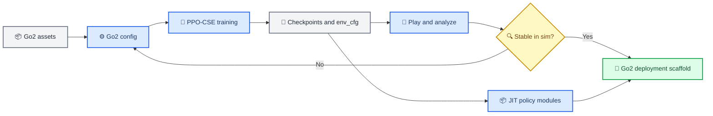

# Go2 sim-to-real locomotion

_Adaptive Energy Regularization (AER) training, evaluation, and deployment workflow for Unitree Go2._

---

## 📋 Project overview

This repository is a Go2-focused adaptation of the AER / Walk These Ways locomotion stack. It provides a neutral package layout (`gym`, `gym_learn`, `gym_deploy`), Go2 URDF/MJCF assets, Go2 Isaac Gym configurations, PPO-CSE training, play/evaluation scripts, and a deployment scaffold for real-robot integration.[^aer-paper][^aer-site][^wtw]

> ⚠️ **Hardware warning:** Real-robot deployment can damage the robot or injure people. Validate policies in simulation, use conservative velocity limits, keep an emergency-stop operator present, and verify every Go2 SDK/control assumption before running on hardware.

## 🗂️ Repository structure

```text
.
├── gym/                     # Isaac Gym environments, Go2 configs, rewards, terrain, logging
│   └── envs/
│       ├── base/            # LeggedRobot base task and shared Cfg defaults
│       ├── go2/             # Go2 configs: original, adaptive energy, terrain adaptive energy
│       ├── rewards/         # CoRL/AER reward container
│       ├── velocity_tracking/# VelocityTrackingEasyEnv task wrapper
│       └── wrappers/        # Observation-history wrapper used by PPO-CSE
├── gym_learn/               # PPO and PPO-CSE runners, actor-critic modules, rollout storage
├── gym_deploy/              # LCM-based deployment utilities and robot-side scripts
├── resources/
│   ├── actuator_nets/       # JIT actuator network used by actuator_net control
│   └── robots/go2/          # Go2 URDF/MJCF/mesh assets
├── scripts/
│   ├── train.py             # Go2 training entrypoint
│   ├── play.py              # Single-command Go2 rollout, logging, video capture
│   ├── play_vary_lin.py     # Linear-speed sweep helper
│   ├── play_vary_ang.py     # Yaw-speed sweep helper
│   └── actuator_net/        # Actuator-network training/evaluation helpers
└── setup.py                 # Editable package install
```



## ⚙️ Environment setup

### Prerequisites

- Ubuntu Linux with an NVIDIA GPU.
- NVIDIA driver and CUDA version compatible with your PyTorch and Isaac Gym Preview build.
- Conda or another Python environment manager.
- Isaac Gym installed and importable as `isaacgym` before importing `torch`.
- For hardware deployment: SSH access to the Go2 onboard computer, LCM, Docker, and the correct Unitree network interface.

### Conda environment

Create or update the requested environment:

```bash
conda create -n aer_wtw python=3.8 -y
conda activate aer_wtw

# Isaac Gym Preview is installed from a local NVIDIA package. Adjust the path
# if your Isaac Gym checkout lives elsewhere.
pip install -e /path/to/isaacgym/python

# Install this Go2 repository and runtime helpers.
cd /path/to/AER
pip install -e .
pip install scipy pyyaml moviepy opencv-python lcm netifaces tqdm matplotlib
```

Isaac Gym may report `libpython3.8.so.1.0: cannot open shared object file` unless the conda library path is visible. Configure an activation hook once so every future `conda activate aer_wtw` sets it automatically:

```bash
conda activate aer_wtw
mkdir -p "$CONDA_PREFIX/etc/conda/activate.d"
cat > "$CONDA_PREFIX/etc/conda/activate.d/aer_wtw_ld_library_path.sh" <<'EOF'
export LD_LIBRARY_PATH="$CONDA_PREFIX/lib:${LD_LIBRARY_PATH:-}"
EOF
```

Then reload the environment before training or play:

```bash
conda deactivate
conda activate aer_wtw
echo "$LD_LIBRARY_PATH" | tr ':' '\n' | grep -x "$CONDA_PREFIX/lib"
```

Verify imports in the expected order:

```bash
python - <<'PY'
import isaacgym
assert isaacgym
import torch
from gym.envs.go2.go2_config_adaptive import AdaptiveGo2Config
cfg = AdaptiveGo2Config()
print('torch', torch.__version__, 'asset', cfg.asset.file)
PY
```

> 📌 **Note:** Isaac Gym Preview packages are usually installed from a local NVIDIA download, not PyPI. If `import isaacgym` fails, install Isaac Gym into `aer_wtw` and rerun the checks.

## 🦾 Go2 assets and configs

Go2 assets live under `resources/robots/go2/`:

```text
resources/robots/go2/
├── urdf/
│   ├── go2.urdf              # Isaac Gym friendly relative mesh paths
│   └── go2_description.urdf  # Original ROS-style URDF reference
├── xml/
│   ├── go2.xml               # Unitree MJCF model
│   ├── scene_go2.xml         # Unitree MJCF scene
│   └── assets/*.obj          # MJCF mesh assets
├── dae/ meshes/              # ROS package meshes
├── config/ launch/ xacro/    # ROS support files
├── CMakeLists.txt
└── package.xml
```

Go2 configuration files:

| File | Purpose |
| --- | --- |
| `gym/envs/go2/go2_config.py` | Base Go2 asset path, spawn pose, command ranges, reward defaults |
| `gym/envs/go2/go2_config_adaptive.py` | Flat-ground adaptive-energy reward configuration |
| `gym/envs/go2/go2_config_adaptive_terrain.py` | Terrain curriculum with adaptive-energy rewards |

## 🏋️ Training Go2

`scripts/train.py` is Go2-only. It builds a Go2 config, writes `env_cfg.yaml`, creates `VelocityTrackingEasyEnv`, wraps it with `HistoryWrapper`, and trains with PPO-CSE.

| Argument | Default | Description |
| --- | --- | --- |
| `--cfg` | `adaptive_en` | `original`, `adaptive_en`, or `adaen_terrain` |
| `--headless` | off | Disable Isaac Gym viewer for remote or faster training |
| `--device` | `0` | CUDA device index, passed as `cuda:<device>` |
| `--seed` | `0` | PyTorch/NumPy/Python random seed |
| `--en_new_actual` | `0.0` | Actual energy regularization scale |
| `--en_new_cmd` | `0.0` | Command-conditioned energy regularization scale |
| `--iterations` | `5000` | PPO learning iterations |
| `--num_envs` | unset | Optional environment-count override for smoke tests or small GPUs |
| `--num_steps_per_env` | unset | Optional PPO rollout-step override for smoke tests |

Flat-ground example:

```bash
conda activate aer_wtw
python scripts/train.py \
  --cfg adaptive_en \
  --headless \
  --device 0 \
  --seed 0 \
  --en_new_actual 0.8
```

Terrain example:

```bash
conda activate aer_wtw
python scripts/train.py \
  --cfg adaen_terrain \
  --headless \
  --device 0 \
  --seed 0 \
  --en_new_actual 0.8
```

For a fast smoke run, reduce both the iteration count and simulation batch size:

```bash
python scripts/train.py \
  --cfg adaptive_en \
  --headless \
  --device 0 \
  --seed 0 \
  --iterations 1 \
  --num_envs 2 \
  --num_steps_per_env 1
```

Training outputs are written below `checkpoints/train/<run-name>/`. The runner exports `checkpoints/body_latest.jit` and `checkpoints/adaptation_module_latest.jit` for evaluation/deployment.

## ▶️ Play and evaluation

`scripts/play.py` loads a trained Go2 checkpoint, disables domain randomization, records a rollout video, and writes analysis files. Use `--num_steps` to shorten smoke rollouts.

```bash
conda activate aer_wtw
python scripts/play.py \
  --device 0 \
  --headless \
  --lin_speed 0.8 \
  --ang_speed 0.0 \
  --terrain_choice flat \
  --terrain_diff 0.1 \
  --num_steps 1000 \
  --model_dir checkpoints/train/seed-0-ennewa-0.8-ennewc-0.0
```

Minimal play smoke against a just-created smoke checkpoint:

```bash
python scripts/play.py \
  --device 0 \
  --headless \
  --lin_speed 0.1 \
  --ang_speed 0.0 \
  --terrain_choice flat \
  --terrain_diff 0.1 \
  --num_steps 5 \
  --model_dir checkpoints/train/seed-0-ennewa-0.0-ennewc-0.0
```

Terrain choices:

| Choice | Meaning |
| --- | --- |
| `flat` | Flat terrain |
| `sslope` | Smooth slope |
| `rslope` | Rough slope |
| `sup` | Stairs up |
| `sdown` | Stairs down |
| `discrete` | Discrete obstacles |

Sweep helpers:

```bash
python scripts/play_vary_lin.py --model_dir <checkpoint-dir> --headless --num_steps 250
python scripts/play_vary_ang.py --model_dir <checkpoint-dir> --headless --num_steps 250
```

Review these outputs before hardware work:

- `analysis/<lin>_<yaw>_env_<id>.mp4`
- `analysis/*statistics*.yaml`
- `analysis/*gait_info*.yaml`
- commanded vs measured base velocity plots
- joint position, velocity, torque, and energy traces

## 🚀 Real-robot deployment

`gym_deploy/` is the deployment scaffold. It loads exported JIT policies, receives state through LCM, sends policy actions, and logs hardware runs.

| Path | Role |
| --- | --- |
| `gym_deploy/scripts/send_to_unitree.sh` | Syncs deployment code/runs to the robot |
| `gym_deploy/installer/install_deployment_code.sh` | Loads the deployment Docker image on the robot |
| `gym_deploy/scripts/deploy_policy.py` | Loads JIT modules and runs `DeploymentRunner` |
| `gym_deploy/envs/lcm_agent.py` | Converts policy tensors to/from LCM messages |
| `gym_deploy/utils/network_config_unitree.py` | Enables multicast routing on the Unitree network interface |
| `gym_deploy/autostart/` | Startup scripts for controller and SDK bridge |

Suggested deployment sequence:

1. Train and evaluate a Go2 policy in Isaac Gym.
2. Place the run under the deployment `runs/` layout expected by `deploy_policy.py`.
3. Connect to the Unitree network and configure multicast:

   ```bash
   python gym_deploy/utils/network_config_unitree.py
   ```

4. Sync code and runs:

   ```bash
   cd gym_deploy/scripts
   bash send_to_unitree.sh
   ```

5. On the robot, load the Docker image if required:

   ```bash
   cd /home/unitree/aer_wtw/gym_deploy/installer
   bash install_deployment_code.sh
   ```

6. Run a short, conservative deployment first:

   ```bash
   cd /home/unitree/aer_wtw/gym_deploy/scripts
   python deploy_policy.py 2000
   ```

Before ground walking, verify joint order, message rates, torque limits, actuator model validity, command scaling, fall detection, command timeout behavior, and emergency-stop behavior on your specific Go2.

## 🧪 Validation and troubleshooting

Fast checks:

```bash
python tests/test_go2_neutral_repo.py
python scripts/train.py --help
python scripts/play.py --help
```

Isaac Gym smoke checks after activating `aer_wtw` with the `activate.d` library-path hook configured:

```bash
python scripts/train.py --cfg adaptive_en --headless --device 0 --seed 0 --iterations 1 --num_envs 2 --num_steps_per_env 1
python scripts/play.py --device 0 --headless --model_dir checkpoints/train/seed-0-ennewa-0.0-ennewc-0.0 --lin_speed 0.1 --ang_speed 0.0 --terrain_choice flat --terrain_diff 0.1 --num_steps 5
```

Common issues:

| Symptom | Likely cause | Fix |
| --- | --- | --- |
| `ModuleNotFoundError: isaacgym` | Isaac Gym is not installed in `aer_wtw` | Install the local Isaac Gym package into the conda env |
| Isaac Gym import crashes after importing `torch` first | Import order violation | Import `isaacgym` before `torch` |
| `body_latest.jit` not found | Wrong checkpoint path or no exported policy yet | Check the run's `checkpoints/` folder |
| Robot falls early in simulation | Policy/config/control mismatch | Lower command ranges and inspect rollout traces |
| Hardware script cannot find network adapter | Unitree interface/multicast is not configured | Set the static IP/interface and rerun network setup |

## 📚 Citation and credits

If this repository is useful in your work, cite the AER paper:

```bibtex
@article{liang2024adaptive,
  title={Adaptive Energy Regularization for Autonomous Gait Transition and Energy-Efficient Quadruped Locomotion},
  author={Liang, Boyuan and Sun, Lingfeng and Zhu, Xinghao and Zhang, Bike and Xiong, Ziyin and Li, Chenran and Sreenath, Koushil and Tomizuka, Masayoshi},
  journal={arXiv preprint arXiv:2403.20001},
  year={2024}
}
```

This environment builds on Walk These Ways by Gabriel Margolis and Pulkit Agrawal, Improbable AI Lab, MIT.[^wtw]

[^aer-paper]: Liang, B., Sun, L., Zhu, X., Zhang, B., Xiong, Z., Li, C., Sreenath, K., & Tomizuka, M. (2024). "Adaptive Energy Regularization for Autonomous Gait Transition and Energy-Efficient Quadruped Locomotion." *arXiv*. https://arxiv.org/abs/2403.20001

[^aer-site]: University of California, Berkeley. "Adaptive Energy Regularization for Autonomous Gait Transition and Energy-Efficient Quadruped Locomotion." https://sites.google.com/berkeley.edu/efficient-locomotion

[^wtw]: Improbable AI. "Walk These Ways: Tuning Robot Control for Generalization with Multiplicity of Behavior." https://github.com/Improbable-AI/walk-these-ways
