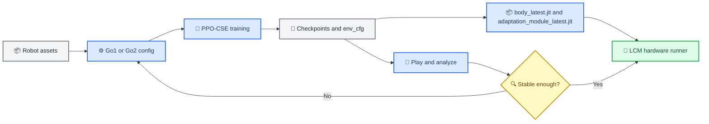

# Go1/Go2 sim-to-real locomotion

_Adaptive Energy Regularization (AER) training, evaluation, and deployment workflow for Unitree quadrupeds._

---

## 📋 Project overview

This repository implements the paper **Adaptive Energy Regularization for Autonomous Gait Transition and Energy-Efficient Quadruped Locomotion** and builds on the Walk These Ways sim-to-real stack.[^aer-paper][^aer-site][^wtw] The original code targets **Unitree Go1**; this fork also adds a **Unitree Go2 asset/configuration path** so new experiments can be trained from the same PPO-CSE pipeline.

| Capability | Go1 | Go2 |
| --- | --- | --- |
| Isaac Gym training | `resources/robots/go1/urdf/go1.urdf` | `resources/robots/go2/urdf/go2.urdf` |
| Adaptive energy flat-ground config | `AdaptiveGo1Config` | `AdaptiveGo2Config` |
| Adaptive energy terrain config | `AdaptiveGo1ConfigTerrain` | `AdaptiveGo2ConfigTerrain` |
| Play/evaluation scripts | `scripts/play.py` | `scripts/play.py --robot go2` |
| Hardware deployment package | `go1_gym_deploy/` | Use as a template; Go2 hardware SDK/LCM validation is still required |

> ⚠️ **Hardware warning:** Real-robot deployment can damage the robot or injure people. Validate policies in simulation, use conservative velocity limits, keep an emergency stop operator present, and adapt Go2 hardware communication before running on a Go2.

## 🗂️ Repository structure

```text
.
├── go1_gym/                 # Isaac Gym environments, robot configs, rewards, terrain, logging
│   └── envs/
│       ├── base/            # LeggedRobot base task and shared Cfg defaults
│       ├── go1/             # Original Go1 configs and velocity-tracking env wrapper
│       ├── go2/             # Go2 configs that reuse the Go1 task interface
│       ├── rewards/         # CoRL/AER reward container
│       └── wrappers/        # Observation-history wrapper used by PPO-CSE
├── go1_gym_learn/           # PPO and PPO-CSE runners, actor-critic modules, rollout storage
├── go1_gym_deploy/          # LCM-based sim-to-real deployment utilities and Unitree scripts
├── resources/
│   ├── actuator_nets/       # JIT actuator network used by actuator_net control
│   ├── robots/go1/          # Go1 URDF/XML/meshes
│   └── robots/go2/          # Go2 URDF/MJCF/meshes added in this fork
├── scripts/
│   ├── train.py             # Main training entrypoint
│   ├── play.py              # Single-command policy rollout, logging, and video capture
│   ├── play_vary_lin.py     # Linear-speed sweep helper
│   ├── play_vary_ang.py     # Yaw-speed sweep helper
│   └── actuator_net/        # Actuator-network training/evaluation helpers
└── setup.py                 # Editable Python package install for the training repo
```



## ⚙️ Environment setup

### Prerequisites

- Ubuntu Linux with an NVIDIA GPU.
- NVIDIA driver and CUDA version compatible with your PyTorch and Isaac Gym Preview build.
- Conda or another Python environment manager.
- Isaac Gym installed and importable as `isaacgym` before importing `torch`.
- For hardware deployment: SSH access to the Unitree computer, LCM, Docker, and the correct Unitree network interface.

### Training machine setup

1. Create and activate an environment. Python 3.8 is the safest baseline for Isaac Gym Preview-era projects; use the exact Python/CUDA/PyTorch combination required by your local Isaac Gym package.

   ```bash
   conda create -n aer_wtw python=3.8 -y
   conda activate aer_wtw
   ```

2. Install Isaac Gym following the NVIDIA package instructions, then verify the import order.

   ```bash
   python - <<'PY'
   import isaacgym
   assert isaacgym
   import torch
   print('torch', torch.__version__, 'cuda', torch.version.cuda)
   PY
   ```

3. Install this repository in editable mode.

   ```bash
   cd /path/to/AER
   pip install -e .
   pip install scipy pyyaml moviepy opencv-python lcm netifaces
   ```

4. Verify the package and Go2 config can be inspected.

   ```bash
   python - <<'PY'
   from go1_gym.envs.go2.go2_config_adaptive import AdaptiveGo2Config
   cfg = AdaptiveGo2Config()
   print(cfg.asset.file)
   print(cfg.init_state.default_joint_angles)
   PY
   ```

> 📌 **Note:** `setup.py` pins several older research dependencies (`ml_logger`, `ml_dash`, `params-proto`, `gym`, `numpy==1.23.5`). If your Isaac Gym/PyTorch install needs a different NumPy build, resolve that conflict inside the conda environment rather than changing system Python.

## 🦾 Go2 asset and config path

The Go2 support mirrors the existing Go1 asset layout:

```text
resources/robots/go2/
├── urdf/
│   ├── go2.urdf              # Isaac Gym friendly relative mesh paths
│   └── go2_description.urdf  # Original ROS-style URDF reference
├── xml/
│   ├── go2.xml               # Unitree MJCF model
│   ├── scene_go2.xml         # Unitree MJCF scene
│   └── assets/*.obj          # MJCF mesh assets
├── dae/                      # ROS package DAE meshes referenced by the original URDF
├── meshes/                   # ROS mesh folder preserved from the supplied package
├── config/ launch/ xacro/    # ROS package support files
├── CMakeLists.txt
└── package.xml
```

`go1_gym/envs/go2/` adds:

- `Go2Config`: Go2 URDF path, nominal spawn height, first-pass base height target, and conservative command limits.
- `AdaptiveGo2Config`: flat-ground adaptive-energy config inheriting the Go1 reward design.
- `AdaptiveGo2ConfigTerrain`: terrain adaptive-energy config inheriting the Go1 terrain curriculum.

The Go2 files are a **simulation adaptation starting point**, not a certified sim-to-real Go2 controller. Before real hardware use, validate joint ordering, torque limits, actuator model behavior, network messages, and safety limits against the Go2 SDK/control stack.

## 🏋️ Training

`scripts/train.py` builds a config, writes `env_cfg.yaml`, creates `VelocityTrackingEasyEnv`, wraps it with `HistoryWrapper`, and trains with the PPO-CSE `Runner` for 5000 iterations. Checkpoints are stored under `checkpoints/train/...`; JIT inference modules are uploaded under each run's `checkpoints/` directory.

### Common arguments

| Argument | Default | Description |
| --- | --- | --- |
| `--robot` | `go1` | `go1` or `go2` robot config/asset family |
| `--cfg` | `adaptive_en` | `original`, `adaptive_en`, or `adaen_terrain` |
| `--headless` | off | Disable Isaac Gym viewer for faster remote training |
| `--device` | `0` | CUDA device index, passed as `cuda:<device>` |
| `--seed` | `0` | PyTorch/NumPy/Python random seed |
| `--en_new_actual` | `0.0` | Actual energy regularization scale (`alpha_en` in AER runs) |
| `--en_new_cmd` | `0.0` | Command-conditioned energy regularization scale |

### Go1 examples

```bash
# Flat-ground adaptive-energy training
python scripts/train.py \
  --robot go1 \
  --cfg adaptive_en \
  --headless \
  --device 0 \
  --seed 0 \
  --en_new_actual 1.0

# Terrain training
python scripts/train.py \
  --robot go1 \
  --cfg adaen_terrain \
  --headless \
  --device 0 \
  --seed 0 \
  --en_new_actual 0.8
```

### Go2 examples

```bash
# First-pass Go2 flat-ground run
python scripts/train.py \
  --robot go2 \
  --cfg adaptive_en \
  --headless \
  --device 0 \
  --seed 0 \
  --en_new_actual 0.8

# First-pass Go2 terrain run
python scripts/train.py \
  --robot go2 \
  --cfg adaen_terrain \
  --headless \
  --device 0 \
  --seed 0 \
  --en_new_actual 0.8
```

> 💡 **Tip:** Start Go2 with conservative speeds and review early rollouts. The Go2 config reuses the Go1 reward/control interface, but the actuator network in `resources/actuator_nets/unitree_go1.pt` is still Go1-derived.

## ▶️ Play and evaluation

`scripts/play.py` loads `env_cfg.yaml`, disables domain randomization for evaluation, loads `checkpoints/body_latest.jit` and `checkpoints/adaptation_module_latest.jit`, runs 1000 simulation steps, records video, and writes analysis plots/statistics.

```bash
python scripts/play.py \
  --robot go1 \
  --device 0 \
  --headless \
  --lin_speed 2.0 \
  --ang_speed 0.0 \
  --terrain_choice flat \
  --terrain_diff 0.1 \
  --model_dir checkpoints/train/seed-0-ennewa-1.0-ennewc-0.0
```

For Go2, point `--model_dir` at a Go2 checkpoint and pass `--robot go2`:

```bash
python scripts/play.py \
  --robot go2 \
  --device 0 \
  --headless \
  --lin_speed 0.8 \
  --ang_speed 0.0 \
  --terrain_choice flat \
  --terrain_diff 0.1 \
  --model_dir checkpoints/train/go2-seed-0-ennewa-0.8-ennewc-0.0
```

Terrain choices supported by the play script are:

| Choice | Meaning |
| --- | --- |
| `flat` | Flat plane / flat terrain proportion |
| `sslope` | Smooth slope |
| `rslope` | Rough slope |
| `sup` | Stairs up |
| `sdown` | Stairs down |
| `discrete` | Discrete obstacles |

Additional sweep helpers:

```bash
python scripts/play_vary_lin.py --robot go2 --model_dir <checkpoint-dir> --headless
python scripts/play_vary_ang.py --robot go2 --model_dir <checkpoint-dir> --headless
```

Review these outputs before considering hardware deployment:

- `analysis/<lin>_<yaw>_env_<id>.mp4`
- `analysis/*statistics*.yaml`
- `analysis/*gait_info*.yaml`
- commanded vs measured base velocity plots
- joint position, velocity, torque, and energy traces

## 🚀 Real-robot deployment

The deployment stack lives in `go1_gym_deploy/` and follows the Walk These Ways LCM-based pattern. The code currently names the package `go1_gym_deploy` and assumes a Unitree Go1-style network/deployment layout. Treat it as a Go1-ready path and a Go2 migration template.

### Deployment files

| Path | Role |
| --- | --- |
| `go1_gym_deploy/scripts/send_to_unitree.sh` | Downloads the deployment Docker image if needed and `rsync`s code/runs to the robot |
| `go1_gym_deploy/installer/install_deployment_code.sh` | Loads the Docker image on the robot |
| `go1_gym_deploy/scripts/deploy_policy.py` | Loads JIT policy modules, creates `LCMAgent`, `StateEstimator`, `RCControllerProfile`, and runs `DeploymentRunner` |
| `go1_gym_deploy/envs/lcm_agent.py` | Converts observations/actions between policy tensors and LCM messages |
| `go1_gym_deploy/utils/network_config_unitree.py` | Finds the `192.168.123.*` interface and enables multicast routing |
| `go1_gym_deploy/autostart/` | Startup scripts for controller and Unitree SDK bridge |

### Go1 deployment flow

1. Copy or keep the trained run under the expected deployment `runs/` layout. `deploy_policy.py` currently searches `../../runs/<label>/*` and then loads `parameters.pkl`, `checkpoints/body_latest.jit`, and `checkpoints/adaptation_module_latest.jit`.
2. Connect to the robot network and verify you can SSH to the robot.
3. Configure multicast on the control computer or robot as needed.

   ```bash
   python go1_gym_deploy/utils/network_config_unitree.py
   ```

4. Send code and runs to the robot.

   ```bash
   cd go1_gym_deploy/scripts
   bash send_to_unitree.sh
   ```

5. On the robot, load the deployment Docker image if required.

   ```bash
   cd /home/unitree/go1_gym/go1_gym_deploy/installer
   bash install_deployment_code.sh
   ```

6. Run a short, conservative deployment first.

   ```bash
   cd /home/unitree/go1_gym/go1_gym_deploy/scripts
   python deploy_policy.py 2000
   ```

### Go2 deployment migration checklist

Before using a Go2 policy on hardware, update and validate the deployment layer:

- Replace Go1 SDK bridge assumptions with the Go2 SDK/control transport used on your robot.
- Verify LCM channel names, message rates, and state fields in `LCMAgent` and `StateEstimator`.
- Confirm joint order exactly matches policy order: `FL_hip`, `FL_thigh`, `FL_calf`, `FR_*`, `RL_*`, `RR_*`.
- Replace or retrain the actuator network if the Go1 actuator model is not valid for Go2.
- Reduce `RCControllerProfile` velocity scales for initial tests.
- Add emergency-stop, fall-detection, torque-limit, and command-timeout checks for your Go2 setup.
- Run tethered tests on blocks before ground walking.

## 🧪 Validation and troubleshooting

### Fast structural checks

```bash
# Check Go2 files exist and XML/URDF mesh references resolve
python - <<'PY'
from pathlib import Path
import re
root = Path('resources/robots/go2')
required = [
    root/'urdf/go2.urdf', root/'urdf/go2_description.urdf',
    root/'xml/go2.xml', root/'xml/scene_go2.xml',
    root/'xml/assets/base_0.obj', root/'meshes/trunk.dae', root/'dae/base.dae',
]
missing = [str(p) for p in required if not p.exists()]
assert not missing, missing
for xml in [root/'xml/go2.xml', root/'xml/scene_go2.xml']:
    for mesh in re.findall(r'<mesh file="([^"]+)"', xml.read_text()):
        assert (root/'xml/assets'/mesh).exists(), mesh
print('Go2 assets OK')
PY

# Check CLI help without running Isaac Gym simulation
python scripts/train.py --help
python scripts/play.py --help
```

### Common issues

| Symptom | Likely cause | Fix |
| --- | --- | --- |
| `ModuleNotFoundError: isaacgym` | Isaac Gym is not installed in the active environment | Activate the correct conda env and install Isaac Gym |
| Isaac Gym import crashes after importing `torch` first | Isaac Gym import order requirement | Import `isaacgym` before `torch` in scripts and tests |
| `body_latest.jit` not found in play | Training did not reach a save point or wrong `--model_dir` | Check the run's `checkpoints/` folder and pass a repo-relative path |
| Robot falls early in Go2 simulation | First-pass Go2 config/control mismatch | Lower command ranges, inspect default pose, tune rewards/control, validate actuator net |
| Hardware script cannot find network adapter | Unitree interface is not on `192.168.123.*` or multicast is not configured | Set the static IP/interface and rerun `network_config_unitree.py` |

## 📚 Citation and credits

If this repository is useful in your work, cite the AER paper:

```bibtex
@article{liang2024adaptive,
  title={Adaptive Energy Regularization for Autonomous Gait Transition and Energy-Efficient Quadruped Locomotion},
  author={Liang, Boyuan and Sun, Lingfeng and Zhu, Xinghao and Zhang, Bike and Xiong, Ziyin and Li, Chenran and Sreenath, Koushil and Tomizuka, Masayoshi},
  journal={arXiv preprint arXiv:2403.20001},
  year={2024}
}
```

This environment builds on Walk These Ways by Gabriel Margolis and Pulkit Agrawal, Improbable AI Lab, MIT.[^wtw]

[^aer-paper]: Liang, B., Sun, L., Zhu, X., Zhang, B., Xiong, Z., Li, C., Sreenath, K., & Tomizuka, M. (2024). "Adaptive Energy Regularization for Autonomous Gait Transition and Energy-Efficient Quadruped Locomotion." *arXiv*. https://arxiv.org/abs/2403.20001

[^aer-site]: University of California, Berkeley. "Adaptive Energy Regularization for Autonomous Gait Transition and Energy-Efficient Quadruped Locomotion." https://sites.google.com/berkeley.edu/efficient-locomotion

[^wtw]: Improbable AI. "Walk These Ways: Tuning Robot Control for Generalization with Multiplicity of Behavior." https://github.com/Improbable-AI/walk-these-ways
